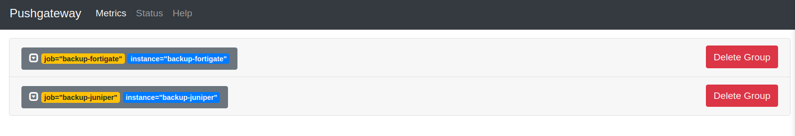
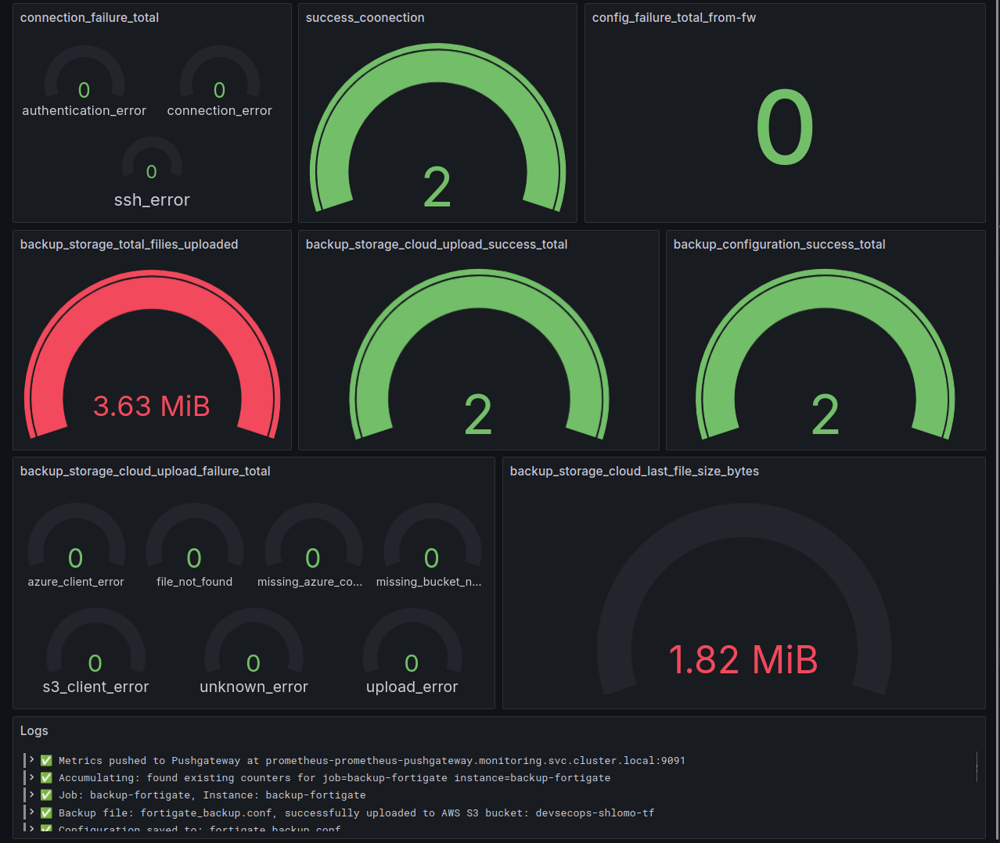

# Multi-Applications Platform

A platform for automated backup of network devices (Fortigate, Juniper, Palo Alto) and a simple web-based Blackjack game, all with optional metrics collection.

## Overview

This platform consists of four main applications:

### backup-fw (Fortigate Firewall Backup)
- Connects to Fortigate firewalls via SSH
- Retrieves full configuration using `show full-configuration` command
- Saves configuration to local file (`fortigate_backup.conf`)
- Optionally uploads to cloud storage (AWS S3, Azure Blob Storage, GCP Cloud Storage)
- Optionally sends metrics to Prometheus Pushgateway

### backup-sw (Juniper Switch Backup)
- Connects to Juniper switches via SSH
- Enters CLI mode and retrieves configuration using `show configuration | display set`
- Saves configuration to local file (`juniper_backup.txt`)
- Optionally uploads to cloud storage (AWS S3, Azure Blob Storage, GCP Cloud Storage)
- Optionally sends metrics to Prometheus Pushgateway

### backup-palo-alto (Palo Alto Firewall Backup)
- Connects to Palo Alto firewalls via REST API (HTTPS)
- Gets API key via keygen, then fetches running config with `show config running`
- Saves configuration to local file (`palo_alto_backup.xml`)
- Optionally uploads to cloud storage (AWS S3, Azure Blob Storage, GCP Cloud Storage)
- Optionally sends metrics to Prometheus Pushgateway

### blackjack-app (Blackjack Game)
- Simple web-based Blackjack card game
- Flask web server running on port 80
- Interactive HTML/JavaScript game interface
- Prometheus metrics exposed at `/metrics` endpoint
- Tracks games played, site visits, HTTP requests, and system metrics

## Features

- ✅ **SSH-based backup** - Secure connection to network devices
- ✅ **Cloud storage** - AWS S3, Azure Blob Storage, and GCP Cloud Storage
- ✅ **Metrics collection** - Prometheus metrics via Pushgateway (backup apps) and `/metrics` endpoint (blackjack)
- ✅ **Modular architecture** - Separated concerns (metrics, cloud upload, main logic)
- ✅ **Local storage** - Backup files stored in container when cloud is disabled
- ✅ **Web-based game** - Simple Blackjack game with interactive UI

## Configuration

### Environment Variables

#### Required Variables

**For backup-fw:**
- `HOST` - Fortigate firewall IP address or hostname
- `PORT` - SSH port (default: 22)
- `USERNAME` - SSH username
- `PASSWORD` - SSH password
- `FW_NAME` - Firewall name/identifier (used to detect prompt)

**For backup-sw:**
- `HOST` - Juniper switch IP address or hostname
- `PORT` - SSH port (default: 22)
- `USERNAME` - SSH username
- `PASSWORD` - SSH password
- `SW_NAME` - Switch prompt identifier (e.g., `@Switch>`)

**For backup-palo-alto:**
- `HOST` - Palo Alto firewall IP address or hostname
- `PORT` - API port (default: 443)
- `USERNAME` - API username
- `PASSWORD` - API password
- `VERIFY_SSL` - Verify HTTPS certificate (`true`/`false`, default: `false` for self-signed)

**For blackjack-app:**
- No environment variables required - runs on port 80 by default

#### Optional Features

**Cloud Storage (AWS S3):**
- `aws` - Enable AWS S3 upload (`true`/`false`, default: `false`)
- `AWS_ACCESS_KEY_ID` - AWS access key ID (required if `aws=true`)
- `AWS_SECRET_ACCESS_KEY` - AWS secret access key (required if `aws=true`)
- `BUCKET_NAME` - S3 bucket name (required if `aws=true`)

**Cloud Storage (Azure Blob Storage):**
- `azure` - Enable Azure upload (`true`/`false`, default: `false`)
- `AZURE_TENANT_ID` - Azure AD tenant ID (required if `azure=true`)
- `AZURE_CLIENT_ID` - Azure AD app (client) ID (required if `azure=true`)
- `AZURE_CLIENT_SECRET` - Azure AD app client secret (required if `azure=true`)
- `AZURE_STORAGE_ACCOUNT` - Storage account name (required if `azure=true`)
- `AZURE_STORAGE_CONTAINER` - Blob container name (required if `azure=true`)

**Cloud Storage (GCP Cloud Storage):**
- `gcp` - Enable GCP upload (`true`/`false`, default: `false`)
- `GCP_BUCKET_NAME` or `GCS_BUCKET_NAME` - GCS bucket name (required if `gcp=true`)
- `GOOGLE_APPLICATION_CREDENTIALS` - Path to service account JSON key file inside the container (e.g. `/app/gcp-credentials.json`; required if `gcp=true`)

**Metrics (Prometheus Pushgateway):**
- `metrics-pushgw` - Enable metrics collection (`true`/`false`, default: `false`)
- `PUSHGATEWAY_ADDR` - Pushgateway address (default: `pushgateway:9091`)
- `PUSHGATEWAY_JOB` - Job name for metrics (e.g. `backup-fw`, `backup-sw`, `backup-palo-alto`)
- `PUSHGATEWAY_INSTANCE` - Instance identifier (default: `HOST` or `unknown`)

## Usage

### Enable AWS S3 Upload

Set the following environment variables:
```bash
aws=true
AWS_ACCESS_KEY_ID=your_access_key
AWS_SECRET_ACCESS_KEY=your_secret_key
BUCKET_NAME=your_bucket_name
```

When AWS is enabled:
- Backup files are uploaded to S3 with format: `backup-fw/fortigate_backup_YYYY-MM-DD_HHMMSS.conf`, `backup-sw/juniper_backup_YYYY-MM-DD_HHMMSS.txt`, or `backup-palo-alto/palo_alto_backup_YYYY-MM-DD_HHMMSS.xml`
- Local backup file is **deleted** after successful upload

### Enable Azure Blob Storage

Set the following environment variables:
```bash
azure=true
AZURE_TENANT_ID=your_tenant_id
AZURE_CLIENT_ID=your_client_id
AZURE_CLIENT_SECRET=your_client_secret
AZURE_STORAGE_ACCOUNT=your_storage_account_name
AZURE_STORAGE_CONTAINER=your_container_name
```

When Azure is enabled:
- Backup files are uploaded to the blob container with the same path format as S3 (e.g. `backup-fw/fortigate_backup_YYYY-MM-DD_HHMMSS.conf`)
- Local backup file is **deleted** after successful upload

### Enable GCP Cloud Storage

Set the following environment variables:
```bash
gcp=true
GCP_BUCKET_NAME=your_bucket_name
GOOGLE_APPLICATION_CREDENTIALS=/app/gcp-credentials.json
```

Mount the GCP service account JSON key file at the path above (e.g. in Docker: `- ./cronjob.json:/app/gcp-credentials.json:ro`). In Kubernetes, create a Secret with the key file content and mount it as a volume.

When GCP is enabled:
- Backup files are uploaded to the GCS bucket with the same path format as S3/Azure (e.g. `backup-fw/fortigate_backup_YYYY-MM-DD_HHMMSS.conf`)
- Local backup file is **deleted** after successful upload

### Enable Metrics Collection

Set the following environment variables:
```bash
metrics-pushgw=true
PUSHGATEWAY_ADDR=your_pushgateway_address
PUSHGATEWAY_JOB=backup-fw
PUSHGATEWAY_INSTANCE=your_instance_name
```

When `metrics-pushgw=true`, backup jobs push metrics to Pushgateway. Prometheus scrapes Pushgateway, and you can visualize the data in Grafana.

**Pushgateway UI** – job/instance groups for each backup (e.g. backup-fortigate, docker-backup-fw, docker-backup-sw, docker-backup-palo-alto):



**Grafana dashboard** – example panels for connection success/failure, configuration success, S3 upload success/failure, and file size metrics:



### Optional: Internal cron scheduling (Docker only)

The backup images include a small internal scheduler that you can use **only when running via Docker or docker-compose** (not in Kubernetes).

- `CRONJOB_ENABLED` – `true` / `false` (default: `false`)  
- `CRONJOB_SCHEDULE` – standard cron expression (e.g. `*/2 * * * *`, `0 3 * * *`, `0 3 1 * *`)
- `PYTHONUNBUFFERED` – set to `1` so logs are flushed immediately (optional but recommended for Docker)

Example (docker-compose only):

```yaml
environment:
  - CRONJOB_ENABLED=true
  - CRONJOB_SCHEDULE=*/2 * * * *   # every 2 minutes
  - PYTHONUNBUFFERED=1            # make Python logs appear immediately in docker logs
```

When enabled, the container stays running and the logs will show a clear description, for example:

- `CRONJOB_ENABLED=true. This Fortigate cron job will run every 2 minutes (cron='*/2 * * * *').`
- `CRONJOB_ENABLED=true. This Juniper cron job will run every day at 03:00 (cron='0 3 * * *').`
- `CRONJOB_ENABLED=true. This Palo Alto cron job will run every month on day 1 at 03:00 (cron='0 3 1 * *').`

In **Kubernetes**, you normally do **not** set these vars. Instead, you use a native `CronJob` resource to control the schedule, and each backup container runs once and exits.

### Local Storage Only (No Cloud Upload)

If `aws=false`, `azure=false`, and `gcp=false` (or not set):
- Backup file is saved locally in the container
- File path is logged: `📁 Path: /app/fortigate_backup.conf`, `/app/juniper_backup.txt`, or `/app/palo_alto_backup.xml`
- File remains in container until next backup or pod restart

## Metrics

### backup-fw Metrics

All metrics are prefixed with `backup_`:

#### Counters
- `backup_connection_success_total` - Total successful firewall connections
- `backup_connection_failure_total{error_type}` - Total failed connections
  - `error_type`: `authentication_error`, `ssh_error`, `connection_error`
- `backup_configuration_success_total` - Total successful configuration backups
- `backup_configuration_failure_total{error_type}` - Total failed backups
  - `error_type`: `configuration_error`
- `backup_storage_cloud_upload_success_total` - Total successful cloud uploads (AWS/Azure/GCP)
- `backup_storage_cloud_upload_failure_total{error_type}` - Total failed cloud uploads
  - `error_type`: `file_not_found`, `missing_bucket_name`, `s3_client_error`, `upload_error`, `unknown_error`, `missing_azure_config`, `azure_client_error`, `missing_gcp_config`, `gcp_client_error` (provider-specific labels only when that provider is enabled)

#### Gauges
- `backup_storage_cloud_last_file_size_bytes` - Size of last uploaded file (bytes)
- `backup_storage_cloud_total_bytes_uploaded` - Total bytes uploaded (accumulated)
- `backup_last_success_timestamp{operation}` - Unix timestamp of last success
  - `operation`: `connection`, `configuration`, `s3_upload`
- `backup_last_failure_timestamp{operation}` - Unix timestamp of last failure
  - `operation`: `connection`, `configuration`, `s3_upload`

#### Histograms
- `backup_duration_seconds{operation}` - Duration of operations (seconds)
  - `operation`: `configuration`, `s3_upload`, `total`
  - Buckets: `[1, 5, 10, 30, 60, 120, 300, 600]`

### backup-sw Metrics

All metrics are prefixed with `backup_sw_`:

#### Counters
- `backup_sw_connection_success_total` - Total successful switch connections
- `backup_sw_connection_failure_total{error_type}` - Total failed connections
  - `error_type`: `authentication_error`, `ssh_error`, `connection_error`
- `backup_sw_configuration_success_total` - Total successful configuration backups
- `backup_sw_configuration_failure_total{error_type}` - Total failed backups
  - `error_type`: `configuration_error`
- `backup_sw_storage_cloud_upload_success_total` - Total successful cloud uploads (AWS/Azure/GCP)
- `backup_sw_storage_cloud_upload_failure_total{error_type}` - Total failed cloud uploads
  - `error_type`: `file_not_found`, `missing_bucket_name`, `s3_client_error`, `upload_error`, `unknown_error`, `missing_azure_config`, `azure_client_error`, `missing_gcp_config`, `gcp_client_error` (provider-specific labels only when that provider is enabled)

#### Gauges
- `backup_sw_storage_cloud_last_file_size_bytes` - Size of last uploaded file (bytes)
- `backup_sw_storage_cloud_total_bytes_uploaded` - Total bytes uploaded (accumulated)
- `backup_sw_last_success_timestamp{operation}` - Unix timestamp of last success
  - `operation`: `connection`, `configuration`, `s3_upload`
- `backup_sw_last_failure_timestamp{operation}` - Unix timestamp of last failure
  - `operation`: `connection`, `configuration`, `s3_upload`

#### Histograms
- `backup_sw_duration_seconds{operation}` - Duration of operations (seconds)
  - `operation`: `configuration`, `s3_upload`, `total`
  - Buckets: `[1, 5, 10, 30, 60, 120, 300, 600]`

### backup-palo-alto Metrics

All metrics are prefixed with `backup_palo_`:

#### Counters
- `backup_palo_connection_success_total` - Total successful API (keygen) connections
- `backup_palo_connection_failure_total{error_type}` - Total failed connections
  - `error_type`: `authentication_error`, `api_error`, `connection_error`
- `backup_palo_configuration_success_total` - Total successful configuration backups
- `backup_palo_configuration_failure_total{error_type}` - Total failed backups
  - `error_type`: `configuration_error`
- `backup_palo_storage_cloud_upload_success_total` - Total successful cloud uploads
- `backup_palo_storage_cloud_upload_failure_total{error_type}` - Total failed cloud uploads
  - `error_type`: `file_not_found`, `missing_bucket_name`, `s3_client_error`, `upload_error`, `unknown_error`, `missing_azure_config`, `azure_client_error`, `missing_gcp_config`, `gcp_client_error` (provider-specific labels only when that provider is enabled)

#### Gauges
- `backup_palo_storage_cloud_last_file_size_bytes` - Size of last uploaded file (bytes)
- `backup_palo_storage_cloud_total_bytes_uploaded` - Total bytes uploaded (accumulated)
- `backup_palo_last_success_timestamp{operation}` - Unix timestamp of last success
  - `operation`: `connection`, `configuration`, `s3_upload`
- `backup_palo_last_failure_timestamp{operation}` - Unix timestamp of last failure
  - `operation`: `connection`, `configuration`, `s3_upload`

#### Histograms
- `backup_palo_duration_seconds{operation}` - Duration of operations (seconds)
  - `operation`: `configuration`, `s3_upload`, `total`
  - Buckets: `[1, 5, 10, 30, 60, 120, 300, 600]`

### blackjack-app Metrics

All metrics are exposed at `/metrics` endpoint:

#### Counters
- `games_played` - Total number of Blackjack games played
- `site_visits` - Total number of visits to the Blackjack site
- `http_requests_total{method, endpoint, status_code}` - Total HTTP requests
  - `method`: HTTP method (GET, POST, etc.)
  - `endpoint`: Request path (/, /metrics, /presentation, etc.)
  - `status_code`: HTTP status code (200, 404, etc.)

#### Gauges
- `cpu_usage_percent` - Current CPU usage percentage
- `memory_usage_bytes` - Current memory usage in bytes
- `network_io_bytes{direction}` - Network I/O counters
  - `direction`: `in` (bytes received) or `out` (bytes sent)

#### Histograms
- `http_request_duration_seconds{method, endpoint}` - HTTP request duration (seconds)
  - `method`: HTTP method (GET, POST, etc.)
  - `endpoint`: Request path (/, /metrics, /presentation, etc.)

## Docker Compose

Example `docker-compose.yml`:

```yaml
services:
  backup-fw:
    build:
      context: ./backup-fw
      dockerfile: Dockerfile
    environment:
      - HOST=your_host
      - PORT=22
      - USERNAME=your_username
      - PASSWORD=your_password
      - FW_NAME=your_fw_name
      - aws=false
      - azure=false
      - gcp=true
      - GCP_BUCKET_NAME=your_bucket_name
      - GOOGLE_APPLICATION_CREDENTIALS=/app/gcp-credentials.json
      - metrics-pushgw=true
      - AWS_ACCESS_KEY_ID=your_aws_access_key_id
      - AWS_SECRET_ACCESS_KEY=your_aws_secret_access_key
      - BUCKET_NAME=your_bucket_name
      - AZURE_TENANT_ID=your_tenant_id
      - AZURE_CLIENT_ID=your_client_id
      - AZURE_CLIENT_SECRET=your_client_secret
      - AZURE_STORAGE_ACCOUNT=your_storage_account
      - AZURE_STORAGE_CONTAINER=your_container
      - PUSHGATEWAY_ADDR=your_pushgateway_address
      - PUSHGATEWAY_JOB=backup-fw
      - PUSHGATEWAY_INSTANCE=your_instance_name
    volumes:
      - backup-fw-backups:/app
      - ./cronjob.json:/app/gcp-credentials.json:ro
    depends_on:
      - pushgateway
    restart: no

  backup-sw:
    build:
      context: ./backup-sw
      dockerfile: Dockerfile
    environment:
      - HOST=your_host
      - PORT=22
      - USERNAME=your_username
      - PASSWORD=your_password
      - SW_NAME=your_sw_name
      - aws=false
      - azure=false
      - gcp=true
      - GCP_BUCKET_NAME=your_bucket_name
      - GOOGLE_APPLICATION_CREDENTIALS=/app/gcp-credentials.json
      - metrics-pushgw=true
      - AWS_ACCESS_KEY_ID=your_aws_access_key_id
      - AWS_SECRET_ACCESS_KEY=your_aws_secret_access_key
      - BUCKET_NAME=your_bucket_name
      - AZURE_TENANT_ID=your_tenant_id
      - AZURE_CLIENT_ID=your_client_id
      - AZURE_CLIENT_SECRET=your_client_secret
      - AZURE_STORAGE_ACCOUNT=your_storage_account
      - AZURE_STORAGE_CONTAINER=your_container
      - PUSHGATEWAY_ADDR=your_pushgateway_address
      - PUSHGATEWAY_JOB=backup-sw
      - PUSHGATEWAY_INSTANCE=your_instance_name
    volumes:
      - backup-sw-backups:/app
      - ./cronjob.json:/app/gcp-credentials.json:ro
    depends_on:
      - pushgateway
    restart: no

  backup-palo-alto:
    build:
      context: ./backup-palo-alto
      dockerfile: Dockerfile
    environment:
      - HOST=your_host
      - PORT=443
      - USERNAME=your_username
      - PASSWORD=your_password
      - VERIFY_SSL=false
      - aws=false
      - azure=false
      - gcp=true
      - GCP_BUCKET_NAME=your_bucket_name
      - GOOGLE_APPLICATION_CREDENTIALS=/app/gcp-credentials.json
      - metrics-pushgw=true
      - AWS_ACCESS_KEY_ID=your_aws_access_key_id
      - AWS_SECRET_ACCESS_KEY=your_aws_secret_access_key
      - BUCKET_NAME=your_bucket_name
      - AZURE_TENANT_ID=your_tenant_id
      - AZURE_CLIENT_ID=your_client_id
      - AZURE_CLIENT_SECRET=your_client_secret
      - AZURE_STORAGE_ACCOUNT=your_storage_account
      - AZURE_STORAGE_CONTAINER=your_container
      - PUSHGATEWAY_ADDR=your_pushgateway_address
      - PUSHGATEWAY_JOB=backup-palo-alto
      - PUSHGATEWAY_INSTANCE=your_instance_name
    volumes:
      - backup-palo-alto-backups:/app
      - ./cronjob.json:/app/gcp-credentials.json:ro
    depends_on:
      - pushgateway
    restart: no

  blackjack-app:
    build:
      context: .
      dockerfile: blackjack-app/Dockerfile
    ports:
      - "8080:80"
    restart: unless-stopped

  pushgateway:
    image: prom/pushgateway:v1.8.0
    ports:
      - "9091:9091"
    restart: unless-stopped

volumes:
  backup-fw-backups:
  backup-sw-backups:
  backup-palo-alto-backups:
```

## Architecture

The applications follow a modular architecture:

```
backup-fw/
├── fortigate_backup.py    # Main script (SSH connection, config retrieval)
├── cloud_upload.py        # Cloud storage logic (AWS/Azure/GCP)
├── metrics.py             # Prometheus metrics and Pushgateway push
└── Dockerfile

backup-sw/
├── juniper-sw.py          # Main script (SSH connection, config retrieval)
├── cloud_upload.py        # Cloud storage logic (AWS/Azure/GCP)
├── metrics.py             # Prometheus metrics and Pushgateway push
└── Dockerfile

backup-palo-alto/
├── palo_alto_backup.py    # Main script (REST API, config retrieval)
├── cloud_upload.py        # Cloud storage logic (AWS/Azure/GCP)
├── metrics.py             # Prometheus metrics and Pushgateway push
└── Dockerfile

blackjack-app/
├── main.py                # Flask web server and metrics
├── blackjack.html         # Game UI and JavaScript
├── presentation.html      # Presentation page (if exists)
└── Dockerfile
```

## Usage Examples

### Running Blackjack App

The blackjack app runs as a simple Flask web server:

```bash
# Build and run with Docker Compose
docker-compose up blackjack-app

# Or build manually
cd blackjack-app
docker build -t blackjack-app .
docker run -p 8080:80 blackjack-app
```

Access the game at `http://localhost:8080`:
- Main game: `http://localhost:8080/`
- Presentation page: `http://localhost:8080/presentation`
- Metrics endpoint: `http://localhost:8080/metrics`

The game features:
- Username input (minimum 2 characters)
- Interactive card game with hit/stand options
- Automatic dealer play
- Win/loss/draw detection

## Exit Codes

**Backup applications (backup-fw, backup-sw, backup-palo-alto):**
- `0` - Success (configuration retrieved and cloud upload succeeded if enabled)
- `1` - Failure (connection error, configuration error, or cloud upload failure)

**Blackjack app:**
- Runs continuously as a web server (no exit codes)

## Notes

**Backup Applications:**
- When cloud upload is disabled, backup files are stored locally in the container
- When cloud upload is enabled and succeeds, local backup files are automatically deleted
- Metrics are only collected and pushed when `metrics-pushgw=true`
- All metrics support accumulation across multiple runs via Pushgateway
- Cloud object names include date/time (e.g. `backup-fw/fortigate_backup_2026-02-07_123456.conf`, `backup-palo-alto/palo_alto_backup_2026-02-07_123456.xml`)
- Azure Blob Storage uses the same env vars across all backup apps: `AZURE_TENANT_ID`, `AZURE_CLIENT_ID`, `AZURE_CLIENT_SECRET`, `AZURE_STORAGE_ACCOUNT`, `AZURE_STORAGE_CONTAINER`
- GCP Cloud Storage requires a service account JSON key file; set `GOOGLE_APPLICATION_CREDENTIALS` to the path of that file inside the container (e.g. mount it as a volume). Use `GCP_BUCKET_NAME` or `GCS_BUCKET_NAME` for the bucket.

**Blackjack App:**
- Simple Flask web application - no configuration needed
- Metrics are always enabled and exposed at `/metrics` endpoint
- System metrics (CPU, memory, network) are updated on each `/metrics` request
- Game metrics increment automatically when users play or visit the site
